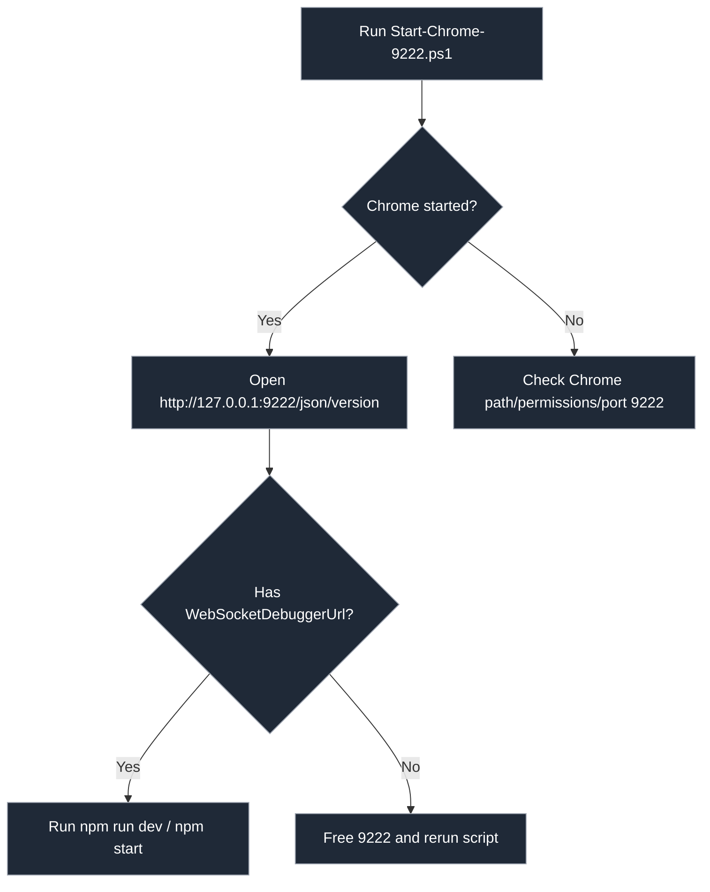

# Chrome MCP Client

A Chrome DevTools MCP client using the `mcp-use` TypeScript package.

## Features

- Launches Chrome with DevTools protocol enabled
- Navigates to a webpage (default: https://www.example.com)
- Uses MCP (Model Coordination Protocol) for AI-powered automation
- Supports LLM integration with SiliconFlow

## Prerequisites

- Node.js >= 18.0.0
- Chrome browser installed on your system

### Required: start Chrome on port 9222

Before running the project, you must start Chrome with remote debugging enabled on port `9222` using the provided PowerShell script:

```powershell
# In project root (Windows PowerShell)
./scripts/Start-Chrome-9222.ps1
```

If your system blocks script execution, run with execution policy bypass:

```powershell
powershell -ExecutionPolicy Bypass -File ./scripts/Start-Chrome-9222.ps1
```

Verification (optional): open the following URL in your browser and ensure it returns JSON with `WebSocketDebuggerUrl`:

```
http://127.0.0.1:9222/json/version
```

Notes:
- The default debug port is `9222`. Keep this port free; the client expects `http://127.0.0.1:9222`.
- The script launches an independent Chrome profile (`--user-data-dir`) and won’t affect your normal Chrome profile.
- If the port is occupied, close other processes using `9222` rather than changing the port.

### Startup Flow



## Installation

```bash
npm install
```

## Usage

### Development Mode

```bash
npm run dev -- "<task instruction>"
```

This will run the project directly from the source files with the specified task instruction.

Example:
```bash
npm run dev -- "Please navigate to https://www.example.com"
```

### Production Mode

1. Build the project:
   ```bash
   npm run build
   ```

2. Run the built project with a task instruction:
   ```bash
   npm start -- "<task instruction>"
   ```

Example:
```bash
npm start -- "Please navigate to https://www.example.com"
```

## Configuration

The project can be configured using environment variables. Copy the `.env.example` file to `.env` and modify the values as needed:

```bash
cp .env.example .env
```

### Environment Variables

- `CHROME_FLAGS`: Additional flags to pass to Chrome (default: "--headless=new")
- `CHROME_DEBUG_PORT`: Debug port for Chrome DevTools (default: 9222)
- `SILICONFLOW_API_KEY`: API key for SiliconFlow LLM service
- `LOG_LEVEL`: Log level (error, warn, info, debug) (default: "info")

## Project Structure

```
src/
├── config/          # Configuration files
├── core/            # Core modules
├── llm/             # Language model integration
├── utils/           # Utility functions
└── index.js         # Main entry point
```

## Scripts

- `npm run dev`: Run in development mode
- `npm start`: Run in production mode (after building)
- `npm run build`: Build the project for production
- `npm test`: Run tests
- `npm run lint`: Lint the code
- `npm run format`: Format the code

## Dependencies

- `mcp-use`: TypeScript package for Model Coordination Protocol
- `chrome-devtools-mcp`: Chrome DevTools MCP implementation
- `@langchain/core`: Core LangChain functionality
- `@langchain/openai`: OpenAI integration for LangChain

## License

MIT